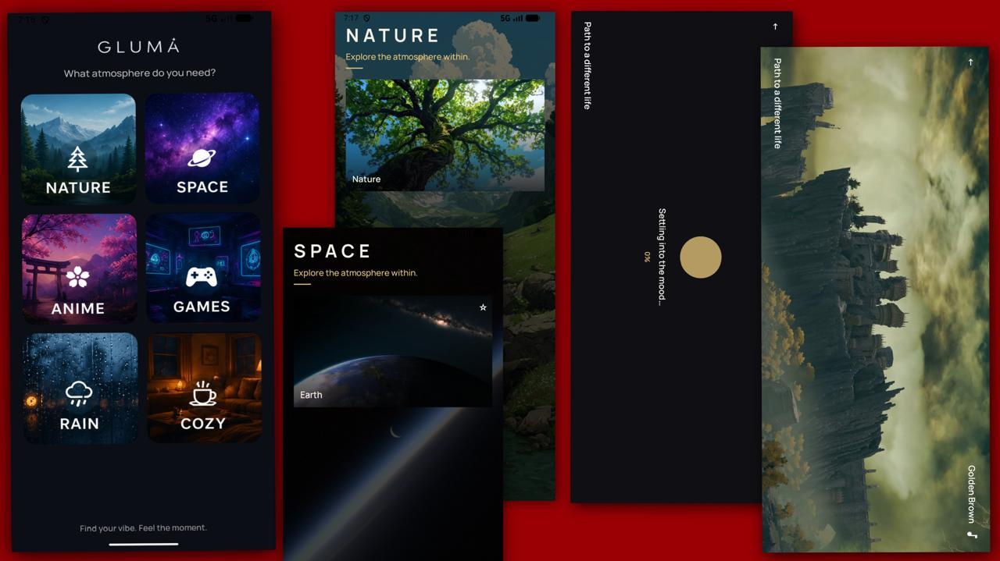

# Vibe 🌌

> **Change the atmosphere. Change the mood.**

Vibe is an Android app that lets you step into different curated atmospheres.

Choose a vibe — **Rainy Korea, Space, Nature, Anime, Games, Cozy, and more** — and the app transforms into an immersive scene with a matching visual, music, quotes, and atmosphere.

The goal is simple:

**Open Vibe → choose how you want to feel → get lost in the atmosphere.**

---

## ✨ The Idea

Sometimes you don't want another app to scroll through.

You just want to relax.

Maybe you're exhausted and want the sound of rain.

Maybe you want to stare at space while listening to something peaceful.

Maybe you want an anime atmosphere while working.

Vibe is built around those moments.

---

Features:

* 🌄 Animated Background
* 🎵 Music 
* 💬 Quote's
* 📱 Screen orientation
* ✨ Visual effects

---

## 🛠 Tech Stack

* Kotlin
* Jetpack Compose
* Android
* Material 3
* Android Media3
* Git & GitHub

---
## Ai use - 
I used AI for pretty much code writing tasks , explaining things and for 
new things that I wouldn't know before.

## 📸 Screenshots

See [LICENSE](LICENSE) for details.
